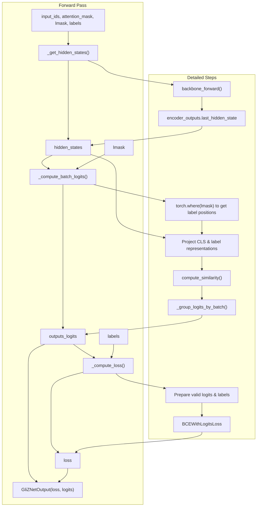

```mermaid
graph TD
    subgraph "Forward Pass"
        A["input_ids, attention_mask, lmask, labels"] --> B["_get_hidden_states()"];
        B --> C["hidden_states"];
        C & lmask --> D["_compute_batch_logits()"];
        D --> E["outputs_logits"];
        E & labels --> F["_compute_loss()"];
        F --> G["loss"];
        E & G --> H["GliZNetOutput(loss, logits)"];
    end

    subgraph "Detailed Steps"
        B --> B1["backbone_forward()"];
        B1 --> B2["encoder_outputs.last_hidden_state"];
        B2 --> C;

        D --> D1["torch.where(lmask) to get label positions"];
        C & D1 --> D2["Project CLS & label representations"];
        D2 --> D3["compute_similarity()"];
        D3 --> D4["_group_logits_by_batch()"];
        D4 --> E;

        F --> F1["Prepare valid logits & labels"];
        F1 --> F2["BCEWithLogitsLoss"];
        F2 --> G;
    end
```
