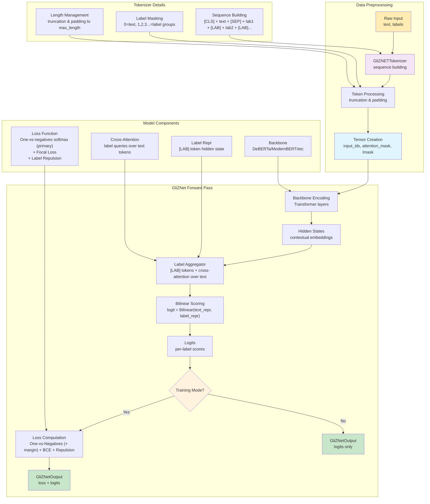

```mermaid
graph TD
    subgraph "Data Preprocessing"
        A["Raw Input<br/>text, labels"] --> B["GliZNETTokenizer<br/>sequence building"];
        B --> C["Token Processing<br/>truncation & padding"];
        C --> D["Tensor Creation<br/>input_ids, attention_mask, lmask"];
    end

    subgraph "GliZNet Forward Pass"
        D --> E["Backbone Encoding<br/>Transformer layers"];
        E --> F["Hidden States<br/>contextual embeddings"];
        F --> G["Label Aggregator<br/>[LAB] tokens + cross-attention over text"];
        G --> H["Bilinear Scoring<br/>logit = Bilinear(text_repr, label_repr)"];
        H --> I["Logits<br/>per-label scores"];
        I --> J{"Training Mode?"};
        J -->|Yes| K["Loss Computation<br/>One-vs-Negatives (+ margin) + BCE + Repulsion"];
        J -->|No| L["GliZNetOutput<br/>logits only"];
        K --> M["GliZNetOutput<br/>loss + logits"];
    end

    subgraph "Tokenizer Details"
        N["Sequence Building<br/>[CLS] + text + [SEP] + lab1 + [LAB] + lab2 + [LAB]..."] --> B;
        O["Label Masking<br/>0=text, 1,2,3...=label groups"] --> C;
        P["Length Management<br/>truncation & padding to max_length"] --> C;
    end

    subgraph "Model Components"
        Q["Backbone<br/>DeBERTa/ModernBERT/etc"] --> E;
        R["Label Repr<br/>[LAB] token hidden state"] --> G;
        S["Cross-Attention<br/>label queries over text tokens"] --> G;
        T["Loss Function<br/>One-vs-negatives softmax (primary)<br/>+ Focal Loss<br/>+ Label Repulsion"] --> K;
    end

    style A fill:#ffecb3
    style D fill:#e1f5fe
    style M fill:#c8e6c9
    style L fill:#c8e6c9
    style J fill:#fff3e0
    style B fill:#f3e5f5
```
