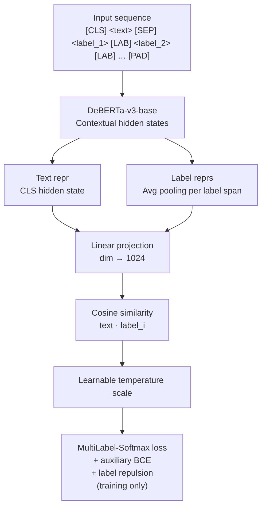
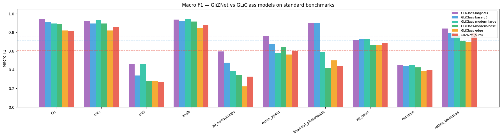

---
language:
  - en
license: apache-2.0
tags:
  - zero-shot-classification
  - text-classification
  - deberta
  - gliznet
  - joint-encoding
  - contrastive-learning
datasets:
  - alexneakameni/ZSHOT-HARDSET-v2
metrics:
  - mrr
  - hit_at_k
  - ndcg
base_model: microsoft/deberta-v3-base
pipeline_tag: zero-shot-classification
---

# GliZNet — DeBERTa-v3-base

**GliZNet** (Generalized Zero-Shot Network) is a zero-shot text classification model that processes the input text and **all candidate labels jointly in a single forward pass**, achieving O(1) inference complexity regardless of the number of labels.

Built on top of [microsoft/deberta-v3-base](https://huggingface.co/microsoft/deberta-v3-base), GliZNet encodes text and labels together in one sequence, generates label-aware contextual embeddings, and scores each label via cosine similarity. A hybrid loss combining multi-label softmax cross-entropy (primary), auxiliary BCE with decoupled temperature, and optional label repulsion sharpens discrimination between semantically similar labels.

> **Paper**: *GliZNet: A Novel Architecture for Zero-Shot Text Classification*  
> Alex Kameni (Ivalua / Massy, France)
>
> **Code**: [github.com/KameniAlexNea/zero-shot-classification](https://github.com/KameniAlexNea/zero-shot-classification)  
> **Synthetic data generation**: [github.com/KameniAlexNea/generate-gliznet-data](https://github.com/KameniAlexNea/generate-gliznet-data)

---

## Model Details

| Property | Value |
|---|---|
| Backbone | `microsoft/deberta-v3-base` (~184 M params) |
| Projection dim | 1024 |
| Similarity metric | Cosine |
| Max sequence length | 1024 tokens |
| Label separator token | `[LAB]` |
| Label representation | Average of label token hidden states |
| Training precision | `bfloat16` |
| Model type ID | `gliznet` |

### Architecture Summary



---

## Usage

### With `ZeroShotClassificationPipeline`

```python
import torch
from gliznet.model import GliZNetForSequenceClassification
from gliznet.tokenizer import GliZNETTokenizer
from gliznet.predictor import ZeroShotClassificationPipeline

model = GliZNetForSequenceClassification.from_pretrained("alexneakameni/gliznet-deberta-v3-base")
model = model.to(torch.bfloat16)
tokenizer = GliZNETTokenizer.from_pretrained("alexneakameni/gliznet-deberta-v3-base")

pipeline = ZeroShotClassificationPipeline(
    model, tokenizer,
    classification_type="multi-label",   # or "multi-class"
    device="cuda",
)

text = "Scientists discover a new exoplanet orbiting a distant star."
labels = ["astronomy", "politics", "cooking", "space exploration", "finance"]

result = pipeline(text, labels)
for ls in sorted(result.labels, key=lambda x: -x.score):
    print(f"  {ls.label:<25} {ls.score:.3f}")
```

### With `from_pretrained` + HuggingFace AutoModel

```python
from transformers import AutoModel, AutoConfig
import gliznet  # triggers Auto* registration

config = AutoConfig.from_pretrained("alexneakameni/gliznet-deberta-v3-base")
model  = AutoModel.from_pretrained("alexneakameni/gliznet-deberta-v3-base")
```

---

## Performance

Evaluated on the **GLiClass benchmark** — 10 standard text-classification datasets reported as **macro F1**.  
GLiClass variants are the closest published competitors; all encode text and labels jointly in a single forward pass.



### Macro F1 on GLiClass benchmark datasets

| Dataset | GliZNet (ours) | GLiClass-large-v3 | GLiClass-base-v3 | GLiClass-modern-large | GLiClass-modern-base | GLiClass-edge |
|---|---|---|---|---|---|---|
| CR | 0.8148 | 0.9398 | 0.9127 | 0.8952 | 0.8902 | 0.8215 |
| SST-2 | 0.8566 | 0.9192 | 0.8959 | 0.9330 | 0.8959 | 0.8199 |
| SST-5 | 0.2737 | 0.4606 | 0.3376 | 0.4619 | 0.2756 | 0.2823 |
| IMDb | 0.8807 | 0.9366 | 0.9251 | 0.9402 | 0.9158 | 0.8485 |
| 20-Newsgroups | 0.3269 | 0.5958 | 0.4759 | 0.3905 | 0.3433 | 0.2217 |
| Enron Spam | 0.5995 | 0.7584 | 0.6760 | 0.5813 | 0.6398 | 0.5623 |
| Financial PhraseBank | 0.4370 | 0.9000 | 0.8971 | 0.5929 | 0.4200 | 0.5004 |
| AG News | 0.6849 | 0.7181 | 0.7279 | 0.7269 | 0.6663 | 0.6645 |
| Emotion | 0.3990 | 0.4506 | 0.4447 | 0.4517 | 0.4254 | 0.3851 |
| Rotten Tomatoes | 0.7917 | 0.8411 | 0.7943 | 0.7664 | 0.7070 | 0.7024 |
| **AVERAGE** | **0.6065** | **0.7520** | **0.7087** | **0.6740** | **0.6179** | **0.5809** |

**Δ GliZNet vs GLiClass-large**: −0.1455 · **Δ vs GLiClass-base**: −0.1022 · **Δ vs GLiClass-modern-large**: −0.0675 · **Δ vs GLiClass-edge**: +0.0256

*GliZNet is a DeBERTa-v3-**base** model trained on synthetic data only; GLiClass-large uses a significantly bigger backbone.*

---

## Training Details

| Setting | Value |
|---|---|
| Dataset | `alexneakameni/ZSHOT-HARDSET-v2` |
| Train / Val / Test split | 54,289 / 1,188 / 1,322 |
| Optimizer | AdamW |
| Learning rate | 1e-4 (cosine schedule, 5% warmup) |
| Weight decay | 1e-3 |
| Batch size | 16 × 2 GPUs × 4 grad. accum. = **128 effective** |
| Epochs | 10 (early stopping, patience=3) |
| Precision | bf16 |
| Distributed training | DeepSpeed ZeRO-2 via `accelerate launch` |
| Hardware | 2 × NVIDIA GPU |
| Loss | Multi-label softmax (weight 1.0) + auxiliary BCE (weight 1.0) + label repulsion (weight 0.1, disabled by default) |
| Max labels per sample | 20 |

---

## Tokenizer

`GliZNETTokenizer` wraps the DeBERTa-v3 sentencepiece tokenizer and adds a custom `[LAB]` separator token. The input format is:

```
[CLS] <text> [SEP] <label_1> [LAB] <label_2> [LAB] ... <label_n> [LAB] [PAD]*
```

The `lmask` tensor (label mask) assigns 0 to text tokens and unique integers 1…n to each label's tokens, allowing the model to pool each label independently.

---

## Limitations

- Trained on synthetic English data; performance on specialized domains (legal, medical) or non-English text may degrade.
- Best results when all candidate labels fit within 1024 tokens. Very large label sets should be batched.
- The model does not produce calibrated probabilities; scores are cosine similarities scaled by a learned temperature.

---

## Citation

```bibtex
@article{kameni2025gliznet,
  title   = {GliZNet: A Novel Architecture for Zero-Shot Text Classification},
  author  = {Alex Kameni},
  year    = {2025},
  note    = {Preprint. Code: https://github.com/KameniAlexNea/zero-shot-classification}
}
```

---

## License

Apache 2.0
