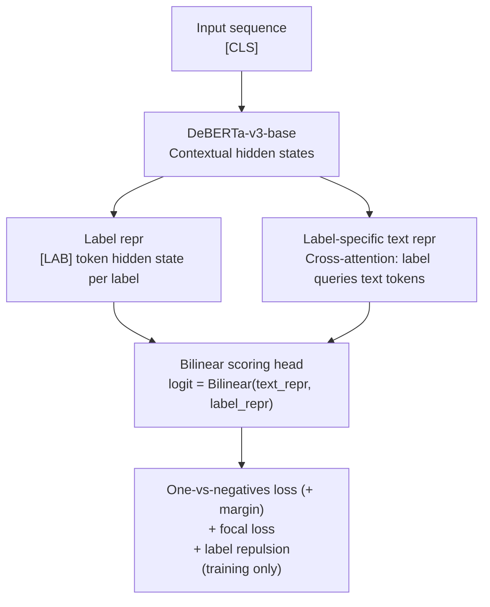

---
language:
  - en
license: apache-2.0
tags:
  - zero-shot-classification
  - text-classification
  - deberta
  - gliznet
  - joint-encoding
  - contrastive-learning
datasets:
  - alexneakameni/ZSHOT-HARDSET-v2
metrics:
  - mrr
  - hit_at_k
  - ndcg
base_model: microsoft/deberta-v3-base
pipeline_tag: zero-shot-classification
---
# GliZNet — DeBERTa-v3-base

**GliZNet** (Generalized Zero-Shot Network) is a zero-shot text classification model that processes the input text and **all candidate labels jointly in a single forward pass**, achieving O(1) inference complexity regardless of the number of labels.

Built on top of [microsoft/deberta-v3-base](https://huggingface.co/microsoft/deberta-v3-base), GliZNet encodes text and labels together in one sequence, extracts each label's representation from its `[LAB]` separator token, builds a label-specific text summary via cross-attention, and scores each pair with a bilinear head. A hybrid loss combining one-vs-negatives softmax (primary, with additive margin), auxiliary focal loss, and a partial VICReg regularizer (variance + covariance terms only — the invariance term is dropped, leaving a pure label-repulsion objective) sharpens discrimination between semantically similar labels.

> **Paper**: *GliZNet: A Novel Architecture for Zero-Shot Text Classification*
> Alex Kameni (Ivalua / Massy, France)
>
> **Code**: [github.com/KameniAlexNea/zero-shot-classification](https://github.com/KameniAlexNea/zero-shot-classification)
> **Synthetic data generation**: [github.com/KameniAlexNea/generate-gliznet-data](https://github.com/KameniAlexNea/generate-gliznet-data)

---

## Model Details

| Property              | Value                                         |
| --------------------- | --------------------------------------------- |
| Backbone              | `microsoft/deberta-v3-base` (~184 M params) |
| Scoring head          | Bilinear (`nn.Bilinear(D, D, 1)`)           |
| Max sequence length   | 512 tokens                                    |
| Label separator token | `[LAB]`                                     |
| Label representation  | `[LAB]` token hidden state                  |
| Training precision    | `bfloat16`                                  |
| Model type ID         | `gliznet`                                   |

### Architecture Summary



---

## Usage

### With `ZeroShotClassificationPipeline`

```python
import torch
from gliznet.model import GliZNetForSequenceClassification
from gliznet.tokenizer import GliZNETTokenizer
from gliznet.predictor import ZeroShotClassificationPipeline

model = GliZNetForSequenceClassification.from_pretrained("alexneakameni/gliznet-deberta-v3-base")
model = model.to(torch.bfloat16)
tokenizer = GliZNETTokenizer.from_pretrained("alexneakameni/gliznet-deberta-v3-base")

pipeline = ZeroShotClassificationPipeline(
    model, tokenizer,
    classification_type="multi-label",   # or "multi-class"
    device="cuda",
)

text = "Scientists discover a new exoplanet orbiting a distant star."
labels = ["astronomy", "politics", "cooking", "space exploration", "finance"]

result = pipeline(text, labels)
for ls in sorted(result.labels, key=lambda x: -x.score):
    print(f"  {ls.label:<25} {ls.score:.3f}")
```

### With `from_pretrained` + HuggingFace AutoModel

```python
from transformers import AutoModel, AutoConfig
import gliznet  # triggers Auto* registration

config = AutoConfig.from_pretrained("alexneakameni/gliznet-deberta-v3-base")
model  = AutoModel.from_pretrained("alexneakameni/gliznet-deberta-v3-base")
```

---

## Performance

Evaluated on the **GLiClass benchmark** — 10 standard text-classification datasets reported as **macro F1**.
GLiClass variants are the closest published competitors; all encode text and labels jointly in a single forward pass.


### Macro F1 on GLiClass benchmark datasets

| Dataset              | GliZNet (ours)   | GLiClass-large-v3 | GLiClass-base-v3 | GLiClass-modern-base |
| -------------------- | ---------------- | ----------------- | ---------------- | -------------------- |
| CR                   | 0.8783           | 0.9281            | 0.9127           | 0.8936               |
| SST-2                | 0.9010           | 0.9176            | 0.8959           | 0.8982               |
| SST-5                | 0.3739           | 0.3798            | 0.3236           | 0.2885               |
| IMDb                 | 0.8909           | 0.9366            | 0.9248           | 0.9154               |
| 20-Newsgroups        | 0.4957           | 0.5806            | 0.5045           | 0.3342               |
| Enron Spam           | 0.4983           | 0.7574            | 0.6252           | 0.5903               |
| Financial PhraseBank | 0.7604           | 0.9023            | 0.9094           | 0.4121               |
| AG News              | 0.7346           | 0.7229            | 0.7209           | 0.7069               |
| Emotion              | 0.4655           | 0.4504            | 0.4450           | 0.4249               |
| Rotten Tomatoes      | 0.7714           | 0.8411            | 0.7943           | 0.7060               |
| **AVERAGE**    | **0.6770** | **0.7417**  | **0.7056** | **0.6170**     |

**Δ GliZNet vs GLiClass-large**: −0.0647 · **Δ vs GLiClass-base**: −0.0286 · **Δ vs GLiClass-modern-base**: +0.0600

*GliZNet is a DeBERTa-v3-**base** model trained on synthetic data with augmentation; GLiClass-large uses a significantly bigger backbone. GliZNet surpasses GLiClass-base on AG News and Rotten Tomatoes.*

---

## Training Details

| Setting               | Value                                                                                                                       |
| --------------------- | --------------------------------------------------------------------------------------------------------------------------- |
| Dataset               | `alexneakameni/ZSHOT-HARDSET-v2` (train split) + `alexneakameni/eval-zero-shot-classification` (test)                    |
| Additional datasets   | 14 MCQ / NLI datasets (1k samples each)                                                                                     |
| Optimizer             | AdamW                                                                                                                       |
| Learning rate         | **1e-5** (cosine schedule, 5% warmup)                                                                                   |
| Weight decay          | 1e-3                                                                                                                        |
| Batch size            | 48 × 2 GPUs × 2 grad. accum. = **192 effective**                                                                    |
| Epochs                | 10 (early stopping, patience=3)                                                                                             |
| Precision             | bf16                                                                                                                        |
| Distributed training  | DDP via `accelerate launch`                                                                                               |
| Hardware              | 2 × NVIDIA GPU                                                                                                             |
| Loss                  | One-vs-negatives softmax (weight 1.0, margin 0.1) + focal loss (weight 0.8, γ=1.85, adaptive γ=0 for pure-class samples, class-balanced averaging) + label repulsion (weight 0.1) |
| Max labels per sample | 20                                                                                                                          |
| Label enrichment      | `LabelContextAttention`: each label attends to peers + their first-pass text evidence (cooperative routing)                 |
| Text augmentation     | nlpaug pipeline (keyboard typos, OCR typos, char swap/delete, word delete, spelling errors, suffix truncation, case change) |
| Label augmentation    | `ScenarioAwareSampler`: needle 20%, few_pos 15%, few_neg 10%, balanced 10%, passthrough 45%. Count sampled via triangular distribution biased toward max. |

---

## Tokenizer

`GliZNETTokenizer` wraps the DeBERTa-v3 sentencepiece tokenizer and adds a custom `[LAB]` separator token. The input format is:

```
[CLS] <text> [SEP] <label_1> [LAB] <label_2> [LAB] ... <label_n> [LAB] [PAD]*
```

The `lmask` tensor (label mask) assigns 0 to text tokens and unique integers 1…n to each label's tokens, allowing the model to pool each label independently.

---

## Limitations

- Trained on synthetic English data; performance on specialized domains (legal, medical) or non-English text may degrade.
- Best results when all candidate labels fit within 1024 tokens. Very large label sets should be batched.
- The model does not produce calibrated probabilities; scores are bilinear compatibility values passed through a sigmoid.

---

## Citation

```bibtex
@article{kameni2025gliznet,
  title   = {GliZNet: A Novel Architecture for Zero-Shot Text Classification},
  author  = {Alex Kameni},
  year    = {2025},
  note    = {Preprint. Code: https://github.com/KameniAlexNea/zero-shot-classification}
}
```

---

## License

Apache 2.0
